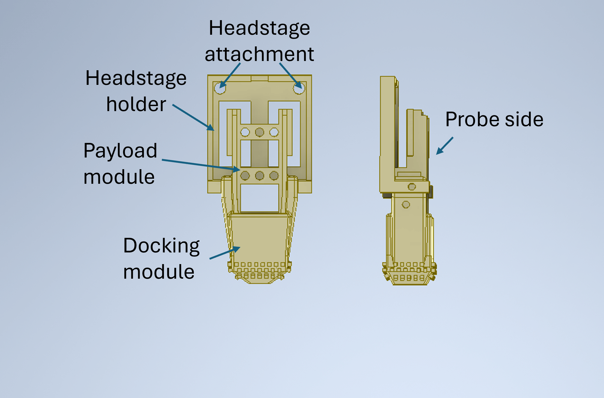

# Parts principally used with freely-moving mice
Each part will have a file associated with it, and where possible, this will be in an editable format. It will also include the material typically used to print the part, and the contact details of the designer. Please acknowledge the designer appropriately if you use any of these parts.  

- [NP1_HeadstageHolder](https://github.com/Coen-Lab/chronic-neuropixels/tree/main/XtraModifications/Mouse_FreelyMoving#np1_headstageholder)
- [NP1_HeadstageHolder_top & NP2-Alpha_HeadstageHolder_top](https://github.com/Coen-Lab/chronic-neuropixels/tree/main/XtraModifications/Mouse_FreelyMoving#np1_headstageholder_top--np2-alpha_headstageholder_top)
- [NP2_SingleProbeMiniatureDockingWithHeadstageHolder & NP2_SingleProbeMiniaturePayload](https://github.com/Coen-Lab/chronic-neuropixels/tree/main/XtraModifications/Mouse_FreelyMoving#np2_singleprobeminiaturedockingwithheadstageholder--np2_singleprobeminiaturepayload)
- [NP1_Payload_SingleProbe_Hollow & NP1_HeadstageHolder_DockingMount](#NP1_Payload_SingleProbe_Hollow-&-NP1_HeadstageHolder_DockingMount)

## NP1_HeadstageHolder
### Function
The NP1_HeadstageHolder was designed to allow free-moving recordings with the [Neuropixels 1.0 version](https://github.com/Coen-Lab/chronic-neuropixels/tree/main/NP1) of the Apollo implant and probes. It prevents damage to the ZIF pads during recordings. In our first recordings with the NP1 implant, we folded the probe flex underneath the caps (within the implant) so that the ZIF connector of the probe permanently protruded from the top of the implant (Fig 1A). During recordings, the headstage was connected to the probe and sat unsupported above the implant/animal.
 
 
Whilst recordings were possible in this configuration, the force exerted by the animal movement on the ZIF connector introduced noise into the recordings. This force and tension on the ZIF connector later damaged the gold pads on the flex, result in frequent error #14, 'BIST_ERROR', for the Parallel Serial Bus probe tests, which indicates a poorly seated probe. 
 
 
The headstage can be attached to the NP1_HeadstageHolder with epoxy (permanent) or a wrap of parafilm (temporary). Prior to recordings, the arms of the NP1_HeadstageHolder are slid onto the ridges of the NP1_Payload (as with the NP1_PayloadHolder) (Fig 1B). The probe flex is lopped between the NP1_Payload and NP1_HeadstageHolder and attached to the ZIF connector at the base (Fig 1C). Importantly, for this to work the flex needs to be full length. 

  

### Material
Selective laser sintering. Material: Nylon PA12. Printed by: www.sgd3d.co.uk. Weight (without the headstage) = 0.5 g 

### Contact
Design was by Nathanael O'Neill, a postdoc in the Lignani lab, UCL email: skgtnon@ucl.ac.uk 
Freely moving recordings using NP1_HeadstageHolder were performed by Nathanael O'Neill and James Street 
The dimensions of the headstage mount of the NP1_HeadstageHolder were from [Emily A. Aery Jones](https://github.com/emilyasterjones)'s excellent [protocol](https://github.com/emilyasterjones/chronic_NPX_mouse) 

### Sofware used
Autodesk, Fusion360 2.0.17721 x86_64

## NP1_HeadstageHolder_top & NP2-Alpha_HeadstageHolder_top
### Function
This part was designed to facilitate freely-moving recordings using a single Neuropixels 1.0/2.0-Alpha probe. Its design is based on the Payload Holder, which was modified to fit the headstage and enable its connections.

*Advantages*
- Stability of probe-headstage connection increases SNR
- Easier and quicker to perform a recording (as the recording cable connection is easier to perform in an awake animal than the flex cable / ZIF connection)

*Disadvantages*
- Increased implant weight and height as mouse carries the headstage permanently

*How to use*
1. Protect the headstage electronics by applying some epoxy resin on it. Be mindful of the flex cable / ZIF connector. Wait at least 30 min for it to dry before applying epoxy on the other side of the headstage.
2. After printing the holder, verify that the headstage fits tightly inside it: it shouldn't move inside the holder, but also shouldn't be so tight that a great amount of force is needed to slide it in place. If necessary, file the inside of the holder to make room for the headstage.
3. Verify that the holder can be properly attached to the payload module. It should 'stick' to the payload module solely by friction. If necessary, after implantation you may add tape, dental cement, or other material to guarantee it will be secure in place, however keep in mind that you will need to do the reverse process during the explantation surgery!
4. (during surgery, after cementing and grounding the probe) Remove the implant from the Payload Holder and connect the headstage to the probe and slide it into the Headstage Holder as you mount the holder in the implant. Pay attention to the orientation of both the headstage (recording cable connection must align with the hole on the top of the holder) and the Holder (it must align with the grooves of the payload module, where it will slide in place). Slide it as much down as possible. In the end, verify that the connections are well-done by recording from the probe.
5. Cover the hole for the recording cable using a small piece of tape that can be removed for recordings, and glued back at the end of them. This will prevent dirt (*eg* cage bedding) from entering into the component.
6. Think about housing! A taller homecage is preferable, as is placing the food pellets in the floor of the cage and using a longer sipper tube for the water. Don't place small igloos or 'tunnels' in the cage.

In our hands, lighter mice (close to 20g in BW) take around 1 week to recover from the implantation surgery, while heaver mice (around 30g) take only a couple of days. We have attached the headstage and holder to the implant at the end of the implantation surgery, however you may perform this step on a separate surgery.

  

### Material
Stereolithography (SLA) printing in a Form 2. Material: Resin Rigid 4000. Printed in-house. Weight (without the headstage) = 1.4 g (NP1.0) or 1.1g (NP2.0-Alpha)

### Contact
Design by Filipe Mendes (Champalimaud Research Hardware and Software Platform), Joana Catarino and José Teixeira (Systems Neuroscience / Mainen Lab). Freely-moving recordings using this component were performed by Joana Catarino and José Teixeira.
 

Filipe Mendes - filipe.mendes@research.fchampalimaud.org
 
Joana Catarino - joana.catarino@ki.se
 
José Teixeira - jose.gomesteixeira@donders.ru.nl

### Sofware used
Solidworks Professional SP5 2022

## NP2-Alpha_SingleProbeDockingWithHeadstage_FullyParameterised & NP2_SingleProbeMiniaturePayload

### Function

This part was designed to have a minimal footprint, for a single Neuropixels 2.0 probe with a headstage that can be 
attached on the implant for long periods of time (e.g. in free moving experiments or in the homecage between 
experiments). The available .stp docking part leaves 3.5mm of probe exposed and has a contact angle of 16 degrees. A 
fully parameterised version is also included, which allows the user to set angles, tapers and amount of probe exposed.
This parameterised file was generated with Autodesk 2024 and is not backwards compatible.

## NP2-Alpha_SingleProbeDockingWithHeadstage & NP2-Alpha_SingleProbePayload

### Function

This part was designed to have a minimal footprint, for a single Neuropixels 2 Alpha probe with a headstage that can be 
attached on the implant for long periods of time (e.g. in free moving experiments or in the homecage between 
experiments). The available .stp docking part leaves 3.5mm of probe exposed and has a contact angle of 16 degrees.

### Material
Printed at SWC-FabLab with a Form 3. Material: Resin Rigid 4000.

### Contact
Design was by Simon Townsend (SWC FabLab, Sainsbury Wellcome Centre, UCL) with Stephen Lenzi (Margrie Lab).
 
Stephen Lenzi - s.lenzi@ucl.ac.uk
 
Simon Townsend - simon.townsend@ucl.ac.uk

### Sofware used
Autodesk Inventor 2023

##  NP1_Payload_SingleProbe_Hollow & NP1_HeadstageHolder_DockingMount ##

### Function

This design has a modified payload module for a single Neuropixels 1.0 probe achieving reduction in weight, and a headstage-holder that can be mounted to sides of any default NP1 docking module, achieving reduction in height. The trough-holes on the NP1 headstage are used to attach the headstage to the headstage holder (the holes on the holder require same threaded insert nuts as in the payoad module).

### Material
Printed at SWC-FabLab with a Form 3. Material: Resin Rigid 4000.

### Contact
Design by Ivana Orsolic (Duan Lab, Sainsbury Wellcome Centre, UCL) and Simon Townsend (SWC FabLab, Sainsbury Wellcome Centre, UCL).
 
Ivana Orsolic - i.orsolic@ucl.ac.uk
 
Simon Townsend - simon.townsend@ucl.ac.uk

### Sofware used
Autodesk Inventor 2023 & 2024
 
 
[![CC BY-NC-SA 4.0][cc-by-nc-sa-shield]][cc-by-nc-sa]

This work is licensed under a
[Creative Commons Attribution-NonCommercial-ShareAlike 4.0 International License][cc-by-nc-sa].

[![CC BY-NC-SA 4.0][cc-by-nc-sa-image]][cc-by-nc-sa]

[cc-by-nc-sa]: http://creativecommons.org/licenses/by-nc-sa/4.0/
[cc-by-nc-sa-image]: https://licensebuttons.net/l/by-nc-sa/4.0/88x31.png
[cc-by-nc-sa-shield]: https://img.shields.io/badge/License-CC%20BY--NC--SA%204.0-lightgrey.svg
